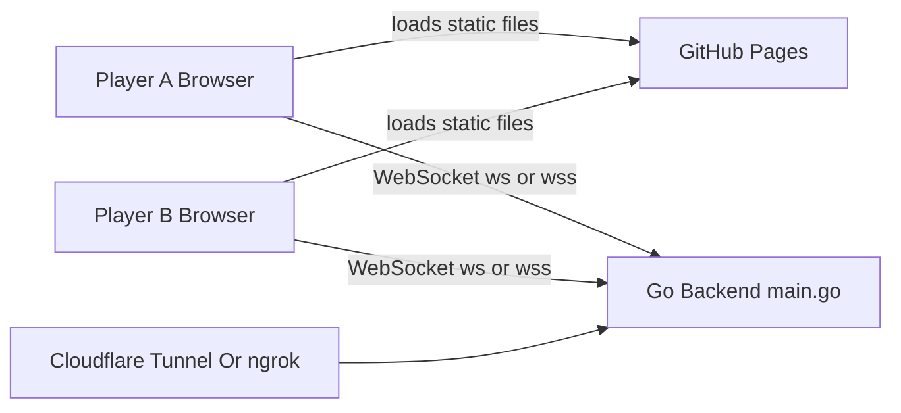
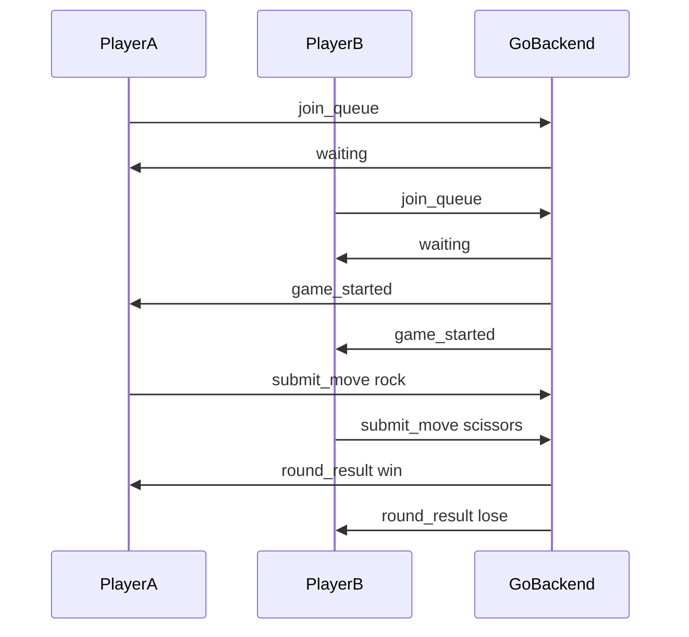

# Multiplayer Rock Paper Scissors Design

## Overview

This project uses a static browser frontend with a Go WebSocket backend.

- Frontend: `index.html`, `style.css`, and `script.js`
- Backend: `main.go`
- Backend tests: `main_test.go`

GitHub Pages hosts only the static frontend files. The Go backend runs
separately on your PC or another host and must be reachable by the browser over
WebSocket. The current UI connects first, shows a main page, and only enters
matchmaking after the player clicks `Enter waiting queue`.

## Architecture



For local development, the frontend connects to:

```text
ws://localhost:3000
```

For GitHub Pages, the frontend should connect through a secure tunnel:

```text
wss://YOUR_TUNNEL_URL
```

## Runtime Flow

1. A browser opens the static page.
2. `script.js` chooses the backend URL from `?server=`, local storage, or
   `ws://localhost:3000` on localhost.
3. `script.js` opens a WebSocket connection to the backend.
4. The connected player sees the main page and clicks `Enter waiting queue`.
5. The browser sends `join_queue`.
6. `main.go` stores the player in the waiting queue.
7. When two players are waiting, `main.go` creates a game room.
8. Both browsers receive `game_started`.
9. Each browser sends `submit_move`.
10. The backend waits until both moves arrive.
11. The backend calculates win, lose, or draw.
12. Both browsers receive `round_result`.
13. The frontend offers `Play new game` or `Back to main page`. `Play new game`
    sends another `join_queue` request for fresh matchmaking.



## Backend State

`main.go` keeps all game state in memory.

- `players`: connected WebSocket players by player ID
- `waitingPlayers`: player IDs waiting for a match
- `games`: active or finished games by game ID
- `stateMu`: mutex protecting shared maps and queue state

Each player stores:

- `id`
- `conn`
- `gameID`
- `readyForRematch`
- `writeMu`

Each game stores:

- `id`
- `playerIDs`
- `moves`
- `status`

State is intentionally not persisted. Restarting the backend clears players,
queues, and games.

## WebSocket Protocol

Client to server:

```json
{ "type": "join_queue" }
{ "type": "submit_move", "move": "rock" }
{ "type": "play_again" }
{ "type": "leave_game" }
```

The current browser UI uses `join_queue`, `submit_move`, and `leave_game`.
`play_again` is still supported by the backend for same-room rematches, but the
current UI's `Play new game` button sends `join_queue` instead.

Server to client:

```json
{ "type": "waiting", "playerId": "player_abcd1234" }
{ "type": "already_queued", "playerId": "player_abcd1234" }
{ "type": "game_started", "gameId": "game_abcd1234", "playerId": "player_abcd1234" }
{ "type": "opponent_moved" }
{ "type": "round_result", "yourMove": "rock", "opponentMove": "scissors", "result": "win" }
{ "type": "opponent_left" }
{ "type": "left_game", "reason": "queue_left" }
{ "type": "not_queued" }
{ "type": "error", "message": "Move must be rock, paper, or scissors." }
```

The frontend and backend are intentionally connected only by this JSON protocol.
That means the backend can be rewritten in another language as long as it keeps
the same messages.

## Important Behaviors

- The backend accepts only `rock`, `paper`, and `scissors`.
- A move is not revealed until both players have submitted.
- A player can submit only one move per round.
- If a queued player disconnects, they are removed from the queue.
- If a queued player clicks `Back to main page`, the backend removes them from
  the queue and sends `left_game` with reason `queue_left`.
- If a player leaves or disconnects during an active game, the opponent receives
  `opponent_left`. Neither player is automatically requeued.
- After a finished round, `join_queue` removes the player from the finished game
  and places them in fresh matchmaking.
- If both players send `play_again` after a finished round, the same room starts
  another round. This path is supported by the backend but is not used by the
  current browser UI.

## Deployment Shape

Local development:

```text
Frontend: http://localhost:8080 or index.html
Backend: ws://localhost:3000
```

GitHub Pages:

```text
Frontend: https://YOUR_USERNAME.github.io/YOUR_REPO/
Backend: wss://YOUR_TUNNEL_URL
```

GitHub Pages cannot run `main.go`. It only serves the static files. The backend
must run separately on your PC, a tunnel, or a hosting provider.

## Validation

Use the Go test suite for backend protocol and game-flow checks:

```sh
go test ./...
```

The tests cover:

- Pairing two waiting players
- Submitting moves and receiving win or lose results
- Notifying the remaining player when an opponent disconnects
- Keeping players out of matchmaking after leaving a queue or active game
- Letting a finished player join a new queue without notifying the old opponent
