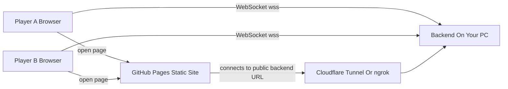
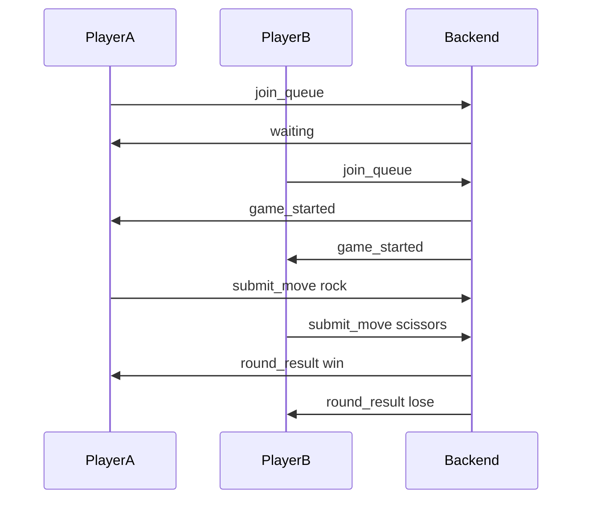

# Multiplayer Rock Paper Scissors Design

## Recommended Stack

Use a static frontend on GitHub Pages and a small Node.js backend on your PC.

- Frontend: `index.html`, `style.css`, `script.js` hosted by GitHub Pages
- Backend: Node.js + WebSocket server, for example using the `ws` package
- Public access during testing: Cloudflare Tunnel or ngrok so GitHub Pages can connect over `wss://`

This keeps the game cheap and simple while still supporting realtime two-player play.

## Architecture



## Game Flow

1. Player visits the GitHub Pages URL.
2. Browser opens a WebSocket connection to your backend public tunnel URL.
3. Browser sends `join_queue`.
4. Backend stores the player in a waiting queue.
5. Once two players are waiting, backend creates a game room and sends both players `game_started`.
6. Each player clicks Rock, Scissors, or Paper.
7. Browser sends `submit_move` with the selected move.
8. Backend waits until both moves arrive.
9. Backend computes the result and sends both players `round_result`.
10. Players can either play again in the same room or return to the queue.



## Backend State Model

Keep all state in memory at first.

- `waitingPlayers`: array of connected players waiting for a match
- `games`: map from `gameId` to game state
- each player: `playerId`, `socket`, `gameId`
- each game: `gameId`, `players`, `moves`, `status`

Example game state shape:

```js
{
  gameId: "abc123",
  players: ["player1", "player2"],
  moves: {
    player1: "rock",
    player2: "scissors"
  },
  status: "playing"
}
```

## WebSocket Messages

Client to server:

```js
{ "type": "join_queue" }
{ "type": "submit_move", "move": "rock" }
{ "type": "play_again" }
```

Server to client:

```js
{ "type": "waiting" }
{ "type": "game_started", "gameId": "abc123", "playerId": "player1" }
{ "type": "opponent_moved" }
{ "type": "round_result", "yourMove": "rock", "opponentMove": "scissors", "result": "win" }
{ "type": "opponent_left" }
```

## Important Behavior

- If one player disconnects while waiting, remove them from the queue.
- If one player disconnects during a game, notify the other player with `opponent_left`.
- Do not reveal either move until both players have submitted.
- Disable buttons after the player submits a move for the current round.
- Validate moves on the backend, accepting only `rock`, `scissors`, or `paper`.

## Deployment Shape

During local development:

```text
Frontend: http://localhost:5173 or local static file
Backend: ws://localhost:3000
```

For GitHub Pages:

```text
Frontend: https://yourname.github.io/rock-paper-scissors/
Backend: wss://your-tunnel-url.example.com
```

Because GitHub Pages uses HTTPS, the backend should be reachable through `wss://`, not plain `ws://`.

## Implementation Steps

1. Build the static single-player UI shell with a waiting state, move buttons, and result area.
2. Add client WebSocket code that connects to the backend and handles server messages.
3. Build the Node.js WebSocket backend with queue pairing and in-memory rooms.
4. Add disconnect handling and basic validation.
5. Test locally with two browser tabs.
6. Expose the backend with Cloudflare Tunnel or ngrok and update the frontend backend URL.
7. Deploy the frontend to GitHub Pages.

## Scope Notes

This design intentionally avoids accounts, databases, persistent score history, and complex matchmaking. If your PC stops or sleeps, the backend goes offline and active games end.